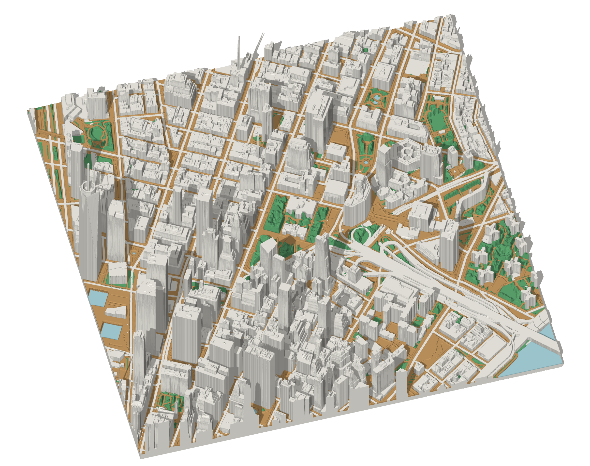

<h1 align="center">3D NYC</h1>

<p align="center">
  Turn any New York City location into a detailed, four-color, ready-to-slice 3MF map.
</p>

<p align="center">
  
</p>

<p align="center"><em>Lower Manhattan and One World Trade Center, generated from public NYC data.</em></p>

3D NYC combines LiDAR terrain, detailed buildings, land cover, streets, water,
and transit entrances into printable material meshes for Bambu Studio.

- Real terrain and smoothed measured canopy relief
- Detailed buildings from official NYC datasets
- Four explicit materials with built-in geometry validation

## Quick start

You need Python 3.12 and
[Bambu Studio](https://bambulab.com/en/download/studio) with the Bambu Lab P2S
profiles installed. The pipeline is pure Python, but it reads those profiles
from Bambu Studio's macOS app bundle by default; see the
[generation guide](docs/generate_3mf.md) for `--bambu-studio`.

```bash
python3 -m venv .venv
source .venv/bin/activate
python -m pip install -r scripts/requirements.txt
```

Source data is downloaded and cached locally once, before your first model:

```bash
scripts/download_all.sh
scripts/cache_all.sh
```

That covers all of NYC and is a long one-time build, safe to rerun and safe to
interrupt. See the [source-cache guide](docs/cache_source_datasets.md) for the
per-dataset commands behind it, caching a smaller area, and offline options.

## Generate a 3MF

Generate the Lower Manhattan model shown above:

```bash
python scripts/generate_3mf.py \
  --latitude 40.7127 \
  --longitude -74.0060 \
  --size-mm 200x200 \
  --output output/models/lower_manhattan.3mf
```

Or generate Central Park and its surrounding buildings from a polygon:

```bash
python scripts/generate_3mf.py \
  --bounding-polygon @data/polygons/central_park.geojson \
  --length-mm 250
```

Open the resulting 3MF in Bambu Studio, review the plate, and slice it. See the
[generation guide](docs/generate_3mf.md) for scale, relief, colors, offline
operation, and validation options.

## Plan a wall-sized map

Split a larger area into gap-free neighboring plates:

```bash
python scripts/plan_map_chunks.py \
  --bounding-polygon @data/polygons/manhattan_island.geojson \
  --scale 10533 \
  --max-chunks 30
```

This writes a preview and the exact per-plate generation commands. Seams are
routed over streets, water, and open ground, never cutting along a building,
bridge, or tunnel. See the [planner guide](docs/plan_map_chunks.md).

## License and data

The code is [MIT licensed](LICENSE). See [data sources and attribution](ATTRIBUTION.md)
for the terms that apply to downloaded data and generated works.

## Tests

```bash
python -m pytest
```
